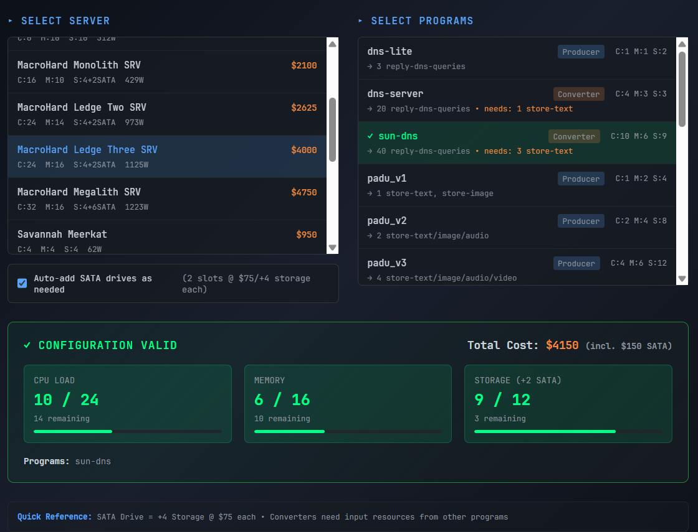
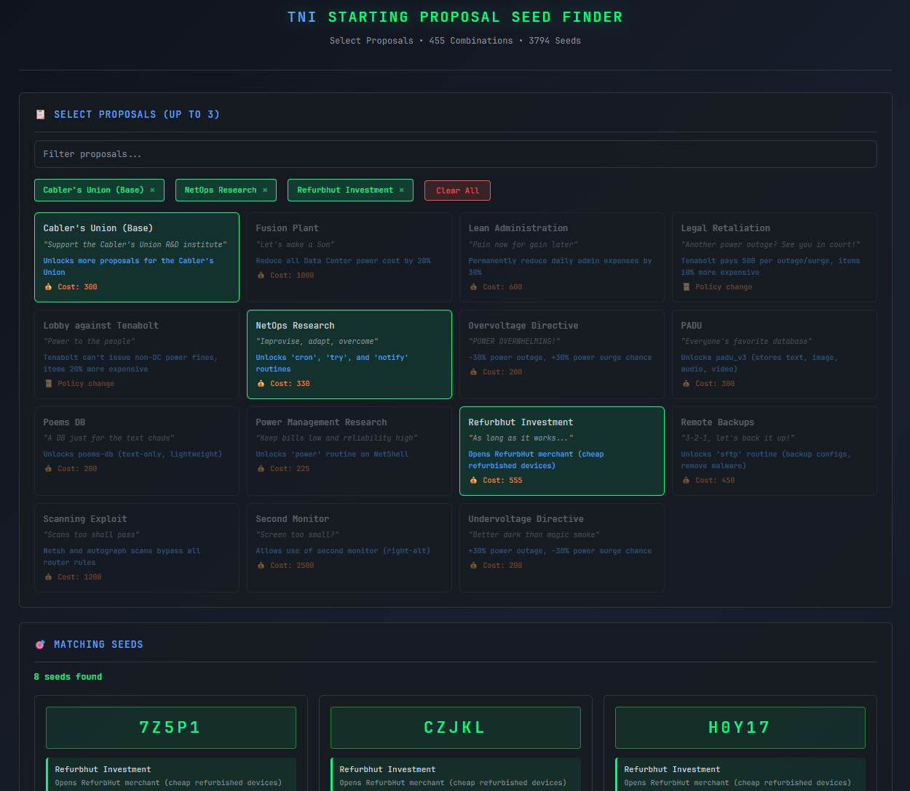

# TNI Toolkit

**Community-built data files and planning tools for [Tower Networking Inc.](https://store.steampowered.com/app/2939600/Tower_Networking_Inc/) by [Pocosia Studios](https://pocosia.com/games/tower-networking-inc/)**

---

## 📑 Table of Contents

| Section | Description |
|---------|-------------|
| [🛠️ Tools](#️-tools) | Standalone planning tools |
| [🗺️ Roadmap](#️-roadmap) | Planned features |
| [📊 Data Files](#-data-files) | JSON datasets |
| [📁 Repository Structure](#-repository-structure) | File layout |
| [📐 JSON Structure](#-json-structure) | Data schemas |
| [🤝 Contributing](#-contributing) | How to help |
| [📜 Credits](#-credits) | Contributors |
| [🔗 Links](#-links) | Related resources |
| [📄 License](#-license) | MIT |

---

## 🛠️ Tools

Standalone HTML files — download and open in any browser. Works offline. All tool-relevant data embedded therein.

### Server/Program Compatibility Calculator

Select a server, check off programs, and instantly see if CPU/Memory/Storage requirements fit. Automatically factors in SATA expansion.

**[Use: Server Calculator](https://salvo-praxis.github.io/tni-toolkit/tools/server-calculator.html) or [Download: `tools/server-calculator.html`](tools/server-calculator.html)**



### Starting Proposal Seed Finder

Search a database of 3,794 verified seeds by selecting up to 3 starting proposals. Find the perfect seed for your preferred playstyle — 455 possible starting combinations.

*Built by the [TNI Seed Harvester](https://github.com/salvo-praxis/tni-seed-harvester) project — an automated world seed and starting proposal data harvesting and frontend publishing pipeline that achieved 100% coverage of all possible starting combinations.*

> 🦄 **Unicorn Seed** — This combination exists exactly once in our database:
>
> | Seed | Combination | Total Cost |
> |------|-------------|------------|
> | `JNLRY` | Scanning Exploit + Second Monitor + Undervoltage | 3900 |

**[Use: Seed Finder](https://salvo-praxis.github.io/tni-toolkit/tools/seed-finder.html) or [Download: `tools/seed-finder.html`](tools/seed-finder.html)**



[⬆️ Back to top](#tni-toolkit)

---

## 🗺️ Roadmap

- [x] Server/Program Compatibility Calculator
- [x] Starting Proposal Seed Finder
- [ ] Store Browser / Cart Calculator
- [ ] Power Budget Calculator  
- [ ] Producer/Converter Dependency Planner
- [ ] Network Throughput Calculator
- [ ] Switch/Router Comparison Tool
- [ ] CLI Command Builder
- [ ] Decentro Network Planner
- [ ] Equipment ROI Calculator

[⬆️ Back to top](#tni-toolkit)

---

## 📊 Data Files

| File | Description |
|------|-------------|
| [`data/tni-store.json`](https://salvo-praxis.github.io/tni-toolkit/data/tni-store.json) | Complete catalog of purchasable items (servers, switches, routers, cables, racks, etc.) |
| [`data/tni-programs.json`](https://salvo-praxis.github.io/tni-toolkit/data/tni-programs.json) | All installable programs with resource requirements, inputs/outputs, and dependencies |
| [`data/tni-cli-commands.json`](https://salvo-praxis.github.io/tni-toolkit/data/tni-cli-commands.json) | Terminal command reference with syntax and examples |

> **Note:** Some warranty values may be inaccurate (recorded during a LAB session). Corrections welcome via PR or issue.

[⬆️ Back to top](#tni-toolkit)

---

## 📁 Repository Structure

```
tni-toolkit/
├── README.md
├── LICENSE
├── data/
│   ├── tni-store.json          # Equipment & store catalog
│   ├── tni-programs.json       # Server programs
│   └── tni-cli-commands.json   # Terminal command reference
├── tools/
│   ├── server-calculator.html  # Server/program compatibility tool
│   └── seed-finder.html        # Starting proposal seed finder
└── docs/
    └── screenshots/
```

[⬆️ Back to top](#tni-toolkit)

---

## 📐 JSON Structure

All data files share a consistent header format:

```json
{
  "_meta": {
    "game": "Tower Networking Inc.",
    "dataset": "store | programs | cli-commands",
    "version": "1.0.0",
    "last_updated": "2025-12-06",
    "description": "...",
    "notes": "..."
  }
}
```

### tni-store.json

Equipment organized by category with consistent fields per device type:

```json
{
  "_meta": { ... },
  "network_switches": [ { "model", "vendor", "ports", "media", "managed", "vlan_support", "traversals_per_tick", "power_w", "price" } ],
  "servers": [ { "model", "vendor", "ports", "cpu", "memory", "storage", "sata_slots", "traversals_per_tick", "power_w", "price" } ],
  "routers": [ ... ],
  "firewalls_and_taps": [ ... ],
  "media_converters_and_repeaters": [ ... ],
  "decentro_rigs": [ ... ],
  "peripherals": [ ... ],
  "ups_and_surge_protection": [ ... ],
  "power_expanders": [ ... ],
  "power_cables": [ ... ],
  "network_cables": { ... },
  "cabling_tools": [ ... ],
  "racks_and_shelving": [ ... ],
  "tower_link_sockets": [ ... ],
  "debuggers_and_test_devices": [ ... ],
  "monitoring_displays": [ ... ]
}
```

### tni-programs.json

Programs with structured input/output definitions:

```json
{
  "_meta": { ... },
  "programs": [
    {
      "name": "dns-server",
      "type": "converter",
      "cpu": 4,
      "memory": 3,
      "storage": 3,
      "input": { "uses": ["store-text"], "amount": 1, "rate": "per tick" },
      "output": { "uses": ["reply-dns-queries"], "amount": 20, "rate": "per tick", "target": "source" },
      "requires": "Running text storage program",
      "stack_limit": 20,
      "description": "..."
    }
  ],
  "program_categories": { "dns": [...], "dhcp": [...], "storage": [...] },
  "use_types": { "storage": [...], "dns": [...] }
}
```

### tni-cli-commands.json

Terminal commands with subcommands, syntax, and examples:

```json
{
  "_meta": { ... },
  "shell_shortcuts": { "up_arrow": "...", "tab": "..." },
  "commands": {
    "firewall": {
      "description": "...",
      "subcommands": { "show": "...", "allow": "...", "deny": "..." },
      "syntax": "firewall <action> [traffic_type] [from <src>] [to <dst>] on <fw_addr> using <debugger_addr>",
      "examples": [ "firewall allow udp/53 to @dns on 123 using 456" ]
    }
  }
}
```

[⬆️ Back to top](#tni-toolkit)

---

## 🤝 Contributing

Found an error? Have data to add? PRs and issues welcome.

When editing JSON files, please:
- Maintain the existing structure and formatting
- Update the `_meta.last_updated` field
- Bump the `_meta.version` patch number for corrections, minor for additions

[⬆️ Back to top](#tni-toolkit)

---

## 📜 Credits

- **Project Lead & Data Collection**: Salvo Praxis
- **Development Assistance**: Claude (Anthropic) — AI pair programming partner
- **Game**: [Tower Networking Inc.](https://store.steampowered.com/app/2939600/Tower_Networking_Inc/) by [Pocosia Studios](https://pocosia.com/)

---

## 🔗 Links

- [Tower Networking Inc. on Steam](https://store.steampowered.com/app/2939600/Tower_Networking_Inc/)
- [Pocosia Studios](https://pocosia.com/games/tower-networking-inc/)
- [TNI Seed Harvester](https://github.com/salvo-praxis/tni-seed-harvester) — Automated seed collection project

---

## 📄 License

MIT License — See [LICENSE](LICENSE) for details.

---

*This is a fan project. [Tower Networking Inc.](https://store.steampowered.com/app/2939600/Tower_Networking_Inc/) is developed by [Pocosia Studios](https://pocosia.com/) — a 2-person team making co-op economic sims. Data extracted from the game for community reference purposes.*

*🏆 Keep up the awesome work [@Pocosia Studios](https://pocosia.com/) — yours is the only game like it, so "Best In Class" doesn't do it justice!*

[⬆️ Back to top](#tni-toolkit)
